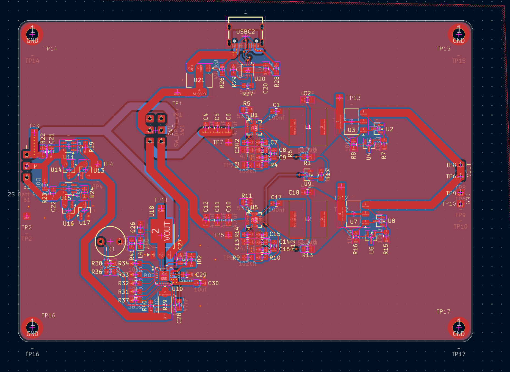

#  PowerBox

> An all-in-one power solution for cyberdecks and portable embedded systems.

PowerBox is my custom-designed PCB that handles USB-C Power Delivery input, dual-cell lithium battery management, balance charging, and regulated power output, all in a single compact board. Designed to push up to **36W** of power to whatever you throw at it.

---

## Overview


*PowerBox was built to power DIY cyberdecks and portable computing projects that need more juice than a standard battery banks can provide.*

---

## Components

PowerBox is built around **7 core subsystems**:

### 1. USB-C Power Delivery Input
A USB-C port paired with a **PD sink controller** that negotiates **12V** from a PD-capable charger. At full load the circuit can draw up to **36W** which is well beyond what standard 5V USB can supply.

### 2. Dual Buck DC-DC Converters (×2)
Two **TPS54620** synchronous step-down converters provide regulated output voltages. The TPS54620 is a 6A, 17V capable device giving plenty of headroom for demanding loads.

### 3. Ideal Diode Circuits (×2)
When USB-C power is present, the battery-fed bucks are switched off to prevent backfeeding the charger. This creates a condition where the buck converter inputs can see negative voltages which is outside their rated range. The ideal diode circuits clamp this safely, acting as electronic diodes with near-zero forward voltage drop.

### 4. BMS Circuit (DW01A)
A battery management system built around the **DW01A** which is a popular and proven lithium-ion protection IC. Handles over-charge, over-discharge, and short-circuit protection for the cell pack.

### 5. 2S Balance Charger (BQ2588RGER)
A proper **2-series balance charger** using TI's **BQ2588RGER**, capable of up to **2A** charge current. Keeps both cells at equal state-of-charge for longevity and safety.

---

##  PCB

The PCB design files are in the [`PowerBox_PCB/`](./PowerBox_PCB) directory. Output gerbers and fabrication files are in [`Output/`](./Output).

---

## Design Logic

```
USB-C PD (12V, 36W)
        │
        ├──► Buck 1 (TPS54620) ──► Ideal Diode ──► Output Rail A
        │
        ├──► Buck 2 (TPS54620) ──► Ideal Diode ──► Output Rail B
        │
        └──► BQ2588RGER Balance Charger ──► 2S Li-Ion Pack
                                                  │
                                              DW01A BMS
                                                  │
                                            Battery Output
```

**Why did I choose 36W / USB-C PD?**

A 2S lithium pack needs to charge while simultaneously powering the system. At full system load, 15W standard USB-C isn't enough, it can't even charge an open MacBook. Requesting **12V via PD** and pulling up to **3A** gives the 36W headroom needed to charge the battery *and* run the load at the same time.

**Why two cells?**

More cells = more capacity. More capacity = the circuit can sustain high loads without the cells entering stress territory. A single-cell design at 36W draw would be asking for trouble (and possibly a fire).

---

## Repository Structure

```
PowerBox/
├── Notes/           # Design notes and calculations
├── Output/          # Gerber files and fabrication outputs
├── Parts/           # Bill of materials and component info
└── PowerBox_PCB/    # KiCad / PCB design files
```

---

## Key ICs

| Component | Part Number | Function |
|-----------|------------|----------|
| Buck Converter | TPS54620 | 6A, 17V synchronous step-down |
| Balance Charger | BQ2588RGER | 2S Li-Ion balance charger, 2A |
| BMS Controller | DW01A | Li-Ion protection IC |
| PD Sink | *(see Parts/)* | USB-C PD 12V negotiation |

---

## License

See [LICENSE](./LICENSE) for details.

---

*Built by [Alvin-Alford](https://github.com/Alvin-Alford)*
